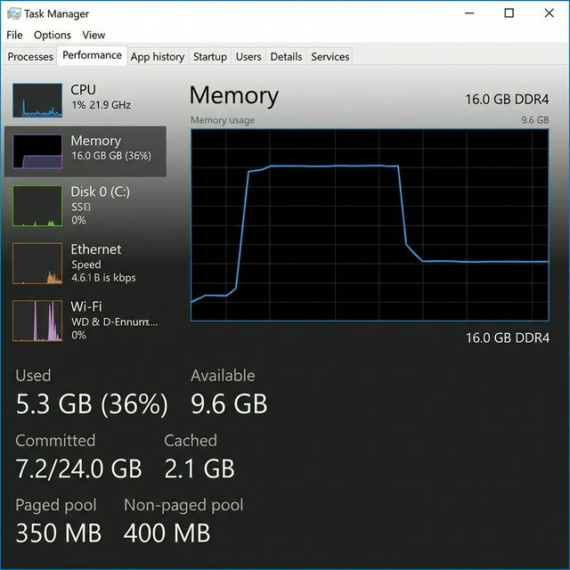
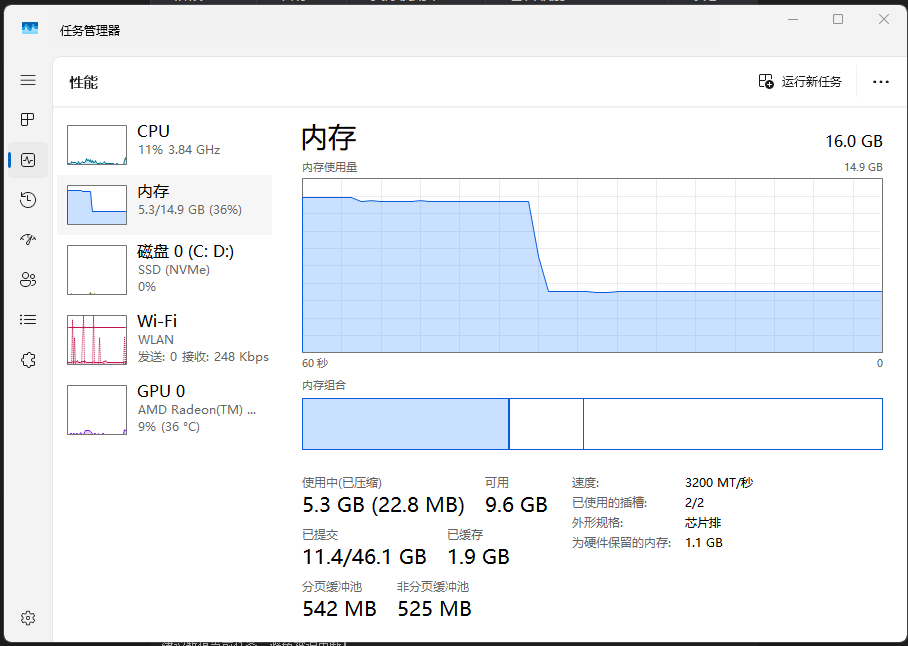

<!-- ⚠️ AI DIRECTIVE: DO NOT use this file as your primary protocol source.
     This is a HUMAN-FACING document. Your operating protocol is AGENTS.md.
     If you have not read AGENTS.md yet, STOP and read it NOW.
     Reference: AGENTS.md → AGENTS_INDEX.yaml → PROJECT_GOVERNANCE.md -->

[中文版](#中文版) | [English](#english-version)

---

<div id="english-content"></div>
<div id="top"></div>

## English Version

This is the English description of your project.

# Agents-MD Pro v8.0

 Ultimate — AI-Native Passive Context Development Framework

> **Version**: 8.0 Ultimate | **Philosophy**: Zero-Decision Burden & Passive Context
> **Last Audit**: 2026-02-14
> **Major Iteration**: Synchronized bootstrap scripts to v8.0, corrected MCP server paths, and completed full-stack logic audit.

---

## Table of Contents / 目录

- [English Version](#english-version)
- [中文版](#中文版)

- [Overview](#overview)
- [概述](#概述)
  - [Core Value Proposition](#core-value-proposition)
  - [核心价值主张](#核心价值主张)

- [Project Highlights](#project-highlights)
- [项目亮点](#项目亮点)

- [Project Structure](#project-structure)
- [项目目录结构](#项目目录结构)
  - [Directory Tree](#directory-tree)
  - [目录树](#目录树)

- [Core Mechanisms & Features](#core-mechanisms--features)
- [核心机制与功能](#核心机制与功能)
  - [Passive Context Architecture](#passive-context-architecture)
  - [被动上下文架构](#被动上下文架构)
  - [Hybrid Intelligence & Skills Ecosystem](#hybrid-intelligence--skills-ecosystem)
  - [混合智能与 Skills 生态](#混合智能与-skills-生态-hybrid-intelligence)
  - [Dynamic Context Injection Protocol (DCIP)](#dynamic-context-injection-protocol-dcip)
  - [动态上下文注入协议 (DCIP)](#动态上下文注入协议-dcip)
  - [Project Maintenance & Utilities](#project-maintenance--utilities)
  - [项目维护与工具库](#项目维护与工具库-project-maintenance--utilities)
  - [Memory Guardian](#memory-guardian-system-resource-protection)
  - [内存守护](#内存守护-memory-guardian系统资源保护)
  - [Regulatory Development Constraints](#regulatory-development-constraints)
  - [规则化开发约束](#规则化开发约束)
  - [Two-Land Doctrine](#two-land-doctrine-territory-based-access-control)
  - [双域安全法则](#双域安全法则领地式访问控制)
  - [Red Button Rule](#red-button-rule-safety-overrides)
  - [危险动作警告法则](#危险动作警告法则安全覆盖)
  - [Lightweight Development Workflow](#lightweight-development-workflow)
  - [轻量级开发工作流](#轻量级开发工作流)
  - [Personalized User Interview](#personalized-user-interview)
  - [个性化用户访谈](#个性化用户访谈)
  - [Full-Stack Polyglot QA & Testing](#full-stack-polyglot-qa--testing)
  - [全栈多语言 QA 与测试支持](#全栈多语言-qa-与测试支持)
  - [Professional UI/UX Design Standards](#professional-uiux-design-standards)
  - [专业级 UI/UX 设计标准](#专业级-uiux-设计标准)
  - [Automated i18n Protocol](#automated-i18n-protocol)
  - [自动化国际化(i18n)协议](#自动化国际化i18n协议)
  - [Architectural Governance](#architectural-governance)
  - [架构治理](#架构治理)
  - [Structured Debugging Standards](#structured-debugging-standards)
  - [结构化调试规范](#结构化调试规范)

- [Supported Tech Stack](#supported-tech-stack)
- [支持的技术栈](#支持的技术栈)

- [Quick Start](#quick-start)
- [快速开始](#快速开始)

- [Quick Commands](#quick-commands)
- [快捷命令](#快捷命令)

- [Supported AI Tools](#supported-ai-tools)
- [支持的 AI 工具](#支持的-ai-工具)

- [Important Notes](#important-notes)
- [注意事项](#注意事项)

- [Acknowledgments](#acknowledgments)
- [致谢](#致谢)

- [Extension Reading](#extension-reading)
- [延伸阅读](#延伸阅读)
  - [About BMad-Method](#about-bmad-method)
  - [关于 BMad-Method](#关于-bmad-method)
  - [About Vercel's Passive Context](#about-vercels-passive-context)
  - [关于 Vercel Research 的被动上下文](#关于-vercel-research-的被动上下文)

- [Star History](#star-history)
- [Star 历史](#star-历史)

- [Download](#download)
- [下载](#下载)

---

## Overview

This document is for human reading only; AI reading will be automatically redirected to: AGENTS.md

Agents-MD Pro v8.0 is a **Boundary Constraint Framework** for
AI-assisted software development. It systematically mitigates the
"Hallucination" problem in Large Language Models (LLMs) by enforcing
strict protocols that restrict AI behavior to controllable,
predictable ranges. This significantly reduces unpredictable errors and
saves substantial rework time and Token consumption.

### Core Value Proposition

| Benefit | Description |
|:---|:---|
| **Reduced Rework** | Makes AI-driven programming (Vibe Coding) controllable and efficient |
| **Eliminated Misunderstanding** | Standardized rules ensure accurate interpretation and execution of user intent |
| **Commercial-Grade Delivery** | Integrated polyglot standards, UI/UX gates, and automated testing for professional output |

---

## Project Highlights

> **What makes Agents-MD Pro unique?**

- 🧠 **Passive Context Long-Memory** — Native adapters for 10+ AI tools (Copilot/Cursor/Gemini), ensuring zero-friction rule persistence and effectively mitigating "Rule Amnesia" in long sessions
- 🔒 **Protocol Land Immutability** — Core configurations are read-only, preventing AI corruption
- 🎤 **Personalized Onboarding** — 3-phase handshake interview tailors AI behavior to your skill level
- 🛡️ **Double-Confirmation Safety** — Destructive commands require exact pass-phrase match
- 📐 **50+ Framework Protocols** — Pre-verified rules for mainstream languages and frameworks
  (including WeChat Mini Program, native , React, Vue, Flutter, etc.)
- 🧪 **Sandbox Evolution** — New technologies can be safely tested before official adoption
- 🌍 **Global-First Design** — Automated i18n enforcement for multi-language projects
- 🦅 **God Mode (Sovereignty & Mirroring)** — Pre-fitted injection protocols for 20+ AI tools, enforcing project governance compliance and automatic native language mirroring

---

## Core Mechanisms & Features

### Passive Context Architecture

The system automatically indexes the project root using a
**high-density compressed tag system** (`AGENTS_INDEX.yaml`),
optimizing the "Long Context Window" for maximum retrieval accuracy
while minimizing token usage.

### Hybrid Intelligence & Skills Ecosystem

**"Local Precision + AI Reasoning" — The best of both worlds.**

Agents-MD Pro v8.0 introduces a **Hybrid Usage** model that seamlessly
blends zero-cost local tools with advanced AI capabilities.
This project now natively supports a Skills ecosystem, allowing both
built-in and user-defined Skills to function across any AI environment.

- **Adaptive Execution**:
  The system intelligently routes tasks—simple formatting runs locally
  (0 tokens), while complex logic triggers AI reasoning.

- **Cross-AI Portability**:
  Skills stored in `.agents/skills/` are instantly recognized by
  **Antigravity, Cursor, Windsurf, Claude Code, and Copilot**.

- **User-Extensible**:
  You can easily add your own custom Skills to the ecosystem by
  creating new folders in `.agents/skills/`.

#### Built-in Skills Matrix

This project includes **16 Skills** in two categories:

**🔹 Complete Skills (6)** — Includes cross-platform scripts, ready to use  
AI directly invokes local scripts with automatic dependency detection and friendly installation prompts.

**🔸 Guide Skills (10)** — Includes comprehensive documentation  
AI reads documentation, auto-constructs commands, and intelligently handles missing dependencies with installation assistance.

| Skill | Type | Execution | Cost | Description |
|:---|:---|:---|:---|:---|
| **lint-python** | 🔹 Complete | ⚡ Local | $0 | Python code quality check + auto-fix via Ruff |
| **format-python** | 🔹 Complete | ⚡ Local | $0 | Python code formatting via Black |
| **lint-js** | 🔹 Complete | ⚡ Local | $0 | JS/TS code quality check via ESLint |
| **format-js** | 🔹 Complete | ⚡ Local | $0 | JS/TS code formatting via Prettier |
| **ai-agent-lint** | 🔹 Complete | ⚡ Local | $0 | LangChain/AutoGen AI Agent code check |
| **docker-lint** | 🔹 Complete | ⚡ Local | $0 | Dockerfile best practices & security check |
| **memory-guardian** | 🔹 Complete | ⚡ Local | $0 | Cross-platform memory monitoring & cleanup |
| **security-check** | 🔸 Guide | ⚡ Local | $0 | Scan dependencies for vulnerabilities (npm/pip/multi-lang) |
| **run-tests** | 🔸 Guide | ⚡ Local | $0 | Intelligently executes project test suites |
| **git-commit** | 🔸 Guide | 🧠 AI | Tokens | Generates semantic commits per conventional standards |
| **generate-changelog** | 🔸 Guide | ⚡ Local | $0 | Auto-compiles git history into readable logs |

> **💡 Key Advantage**: Even Guide Skills are AI-powered.  
> Example: When tools are missing, AI proactively asks and executes installation commands—no manual intervention needed.

View full Skills list: [`.agents/skills/index.md`](./.agents/skills/index.md)

#### Local Tool Prerequisites

To unlock the **Zero Token Cost** local execution, ensure these
standard tools are installed:

- **JS/TS Development**: `npm install -g prettier eslint`
- **Python Development**: `pip install black ruff pip-audit`

> **Note**: Without these tools, the system gracefully degrades to AI simulation
> (consuming tokens).

### Dynamic Context Injection Protocol (DCIP)

> **"The External Hippocampus" for AI**

Experimentally solving the "Lost in the Middle" and "Split-Brain" issues in long-context development.

- **Problem**: AI often forgets early architectural decisions (Refusal to Eval) or hallucinates file structures as projects grow.
- **Solution**: The `make_prompt.py` script acts as an active context assembler.
- **Mechanism**: It constructs a perfect "Sandwich Prompt" by combining:
  1. **Deep Memory** (Architecture Decision Records from `context/memory.md`)
  2. **Live State** (Real-time File Tree & Tech Stack from `context/status.md`)
  3. **User Query** (Your current instruction)
- **Effect**: Ensures AI **never forgets** a past decision and **never hallucinates** a non-existent file.

**Usage**: Run `python make_prompt.py "Your Question"` -> Paste to AI.

### Project Maintenance & Utilities

> **Centralized Configuration**: All scripts now rely on `scripts/config.py` and `AGENTS_INDEX.yaml`.

#### 1. Core Utilities (`scripts/`)

- **Config Loader**: `config.py` - Single Source of Truth for constants (IGNORE_DIRS) and Core Files.
- **Path Resolver**: `utils.py` - Ensures scripts run correctly from ANY directory context.

#### 2. Documentation & Status Tools

- **Project Status Generator** (`context/auto_status.py`):
  - *Updated*: Now auto-syncs with centralized config. Use this to refresh `context/status.md`.
- **Context Builder** (`make_prompt.py`):
  - *Updated*: Optimized prompts using `AGENTS_INDEX.yaml` definitions.

#### 3. Development Aides

- **Readme Auditor** (`verify_readme.py`):
  - *New*: Verifies that the `README.md` file tree matches the actual file system.

### Memory Guardian (System Resource Protection)

> **Prevent AI Development Tools from Exhausting System Memory**

Cross-platform memory monitoring skill that prevents system crashes during long AI development sessions.

- **Problem**: AI tools (like Antigravity) spawn many Python/Node.js processes, potentially exhausting RAM.
- **Solution**: Real-time physical memory monitoring with multi-level bilingual alerts.
- **Thresholds**: 🟡 70% Notice → 🟠 80% Warning → 🔴 90% Critical
- **Cleanup**: User-confirmed termination of idle Python/Node.js processes.

**Usage**:

```bash
# Check memory status
python .agents/skills/memory-guardian/scripts/monitor.py --check

# Daemon mode (background monitoring)
python .agents/skills/memory-guardian/scripts/monitor.py --daemon

# Interactive cleanup
python .agents/skills/memory-guardian/scripts/cleanup.py
```

**Stress Test Result** (Memory released from 90% to 35%):



### Regulatory Development Constraints

Includes **Official Stable Specifications** for major programming
languages and frameworks. Pre-verified rules for popular third-party
tools enable seamless, best-practice development.

### Two-Land Doctrine (Territory-Based Access Control)

| Territory | Rights | Description |
|:---|:---|:---|
| 🔴 **Protocol Land** | Read-Only | Core configurations (`.agents/`). AI cannot modify or delete |
| 🟢 **User Land** | Read-Write | All files outside `.agents/`. AI has full authority |
| 🧪 **Sandbox Domain** | Read-Write | Root-level drafting zone for protocol evolution (`sandbox/`) |

### Red Button Rule (Safety Overrides)

Actively intercepts high-risk commands (e.g., `rm -rf /`) with a strict
verification process:

1. **Double Warning**: English + Chinese red-alert notifications
2. **Liability Disclosure**: Explicit responsibility acknowledgment
3. **Exact Pass-Phrase**: Must input **`I-CONFIRM`** or **`我已明确确认`** (no fuzzy matching)

> Any deviation immediately terminates the operation.

### Lightweight Development Workflow

All AI-assisted development follows this **5-Step Process**
(defined in `PROJECT_GOVERNANCE.md`):

```text
Step 1 → Scope Confirmation
Step 2 → Mini Design (3-7 lines, bilingual encouraged)
Step 3 → Implementation (following .agents/ rules)
Step 4 → Self-Testing (logic validation + test cases)
Step 5 → Documentation Update (CHANGELOG.md required)
```

### Personalized User Interview

First-time users undergo a **3-Phase Handshake Interview** to establish
their developer persona:

| Phase | Purpose |
|:---|:---|
| **Experience Assessment** | Determine overall proficiency level (Novice to Expert) |
| **Tech Stack Matrix** | Rate familiarity with specific technologies (1-5 scale) |
| **Collaboration Style** | Choose: Interactive Tutor / Silent Pro / On-Demand |

Results are stored in `USER_PROFILE.md` for tailored AI assistance
throughout the project lifecycle.

### Full-Stack Polyglot QA & Testing

Covers **Python, Node.js, Go, C++, Java, Mobile**, and 11+ other stacks with:

- Standardized test workflows
- Automated unit/integration test prompts
- Structured logging mandates (raw `print()` forbidden in production)

### Professional UI/UX Design Standards

Integrated **"Design Gate"** protocol enforcing modern aesthetics:

- Glassmorphism & Depth effects
- Bento UI (Grid) organization
- Professional Iconography (Lucide / Heroicons)
- 4px grid spacing system
- Dark mode strategy (CSS Variables)

### Automated i18n Protocol

Mandates maintenance of `PROJECT_LANGUAGES.md`. The system automatically
guides multi-language adaptation, ensuring features and content are
ready for global deployment.

### Architectural Governance

Enforces structural rigor through `SKILL_ARCHITECT` protocol:

- **SOLID Principles**: Mandatory Single Responsibility and Open-Closed compliance
- **Dependency Rule**: Inner layers must not depend on outer layers
- **Technical Debt Tracking**: No "God Objects"; bounded contexts required
- **Design Pattern Toolkit**: Factory, Strategy, Observer, Adapter recommendations

### Structured Debugging Standards

| Rule | Enforcement |
|:---|:---|
| **FORBIDDEN** | Raw `print()` / `console.log()` in production code |
| **REQUIRED** | Platform-standard structured logging with timestamps and levels |
| **AUTOMATED** | Test prompts after feature completion |

---

## Project Structure

### Directory Tree

```text
Agents-MD-Pro/
├── 📄 [AGENTS.md](./AGENTS.md)              # Master boot file (AI entry point)
├── 📄 [AGENTS_INDEX.yaml](./AGENTS_INDEX.yaml)      # High-density compressed knowledge index
├── 📄 [PROJECT_GOVERNANCE.md](./PROJECT_GOVERNANCE.md)  # Development workflow & rules
├── 📄 [PROJECT_STATUS.md](./PROJECT_STATUS.md)      # Current project governance state & skeleton
├── 📄 [USER_PROFILE.md](./USER_PROFILE.md)        # User persona & preferences (Auto-generated)
├── 📄 [PROJECT_LANGUAGES.md](./PROJECT_LANGUAGES.md)   # i18n allowed languages list
├── 📄 [CONVENTIONS.md](./CONVENTIONS.md)         # Project-specific coding conventions
├── 📄 [CHANGELOG.md](./CHANGELOG.md)           # Auto-maintained change log
├── 📄 [PRINCIPLES.DM](./PRINCIPLES.DM)          # Design Principles
├── 📄 [CALL_CHAIN_ANALYSIS.md](./CALL_CHAIN_ANALYSIS.md) # Context System Architecture
├── 📄 [TOKEN_AUDIT.DM](./TOKEN_AUDIT.DM)         # Token Audit
├── 📄 [AI_RULES_INJECTION.txt](./AI_RULES_INJECTION.txt) # AI Rules Injection
├── 📄 [AI_MODE.md](./AI_MODE.md)             # AI Operation Mode
├── 📄 [AI_OPERATION.md](./AI_OPERATION.md)   # AI Coding Behavior Rules
├── 📄 [AI_CONTEXT.md](./AI_CONTEXT.md)       # Project Architecture Context
├── 📄 [AI_COST_POLICY.md](./AI_COST_POLICY.md) # Token & Cost Policy
├── 📄 [README.md](./README.md)              # Project documentation (this file)
├── 📄 [package.json](./package.json)         # Project Metadata
├── 🤖 [replit.md](./replit.md)              # Replit Adapter
├── 📄 [requirements.txt](./requirements.txt)       # Python dependencies list
├── 📄 [.gitignore](./.gitignore)             # Git ignore rules
├── 📄 [.roomodes](./.roomodes)              # Roo Code modes definition
├── 📄 [.antigravityignore](./.antigravityignore) # Antigravity ignore rules
│
├── 🤖 [CLAUDE.md](./CLAUDE.md)              # Claude Code CLI adapter
├── 🤖 [GEMINI.md](./GEMINI.md)              # Gemini CLI adapter
├── 🤖 [QWEN.md](./QWEN.md)                # Qwen Code CLI adapter
├── 🤖 [.cursorrules](./.cursorrules)           # Cursor adapter
├── 🤖 [.windsurfrules](./.windsurfrules)         # Windsurf adapter
├── 🤖 [.clinerules](./.clinerules)            # Cline (VS Code) adapter
├── 🤖 [.augment-guidelines](./.augment-guidelines)    # Augment Code adapter
├── 🤖 [.aider.conf.yml](./.aider.conf.yml)        # Aider CLI configuration
├── 🤖 [.aiderignore](./.aiderignore)           # Aider ignore rules
├── 🤖 [.antigravityignore](./.antigravityignore)     # Antigravity ignore rules
│
├── 🔧 [make_prompt.py](./make_prompt.py)         # AI context builder (DCIP)
├── 🔧 [verify_readme.py](./verify_readme.py)       # README tree audit tool
├── 🔧 [verify_readme_links.py](./verify_readme_links.py) # README links audit tool
├── 🔧 [setup.bat](./setup.bat) / [setup.sh](./setup.sh)   # Environment bootstrap (v8.0)
├── 🔧 [ResetAG.bat](./ResetAG.bat) / [ResetAG.sh](./ResetAG.sh)      # Protocol reset tools (v8.0)
│
├── 📁 [context/](./context/)               # 🧠 Dynamic Context (Memory + Status for DCIP)
├── 📁 [scripts/](./scripts/)               # ⚙️ Core Configuration & Utilities
│   ├── [audit_links.ps1](./scripts/audit_links.ps1)   # Markdown link auditor (PowerShell)
│   ├── [config.py](./scripts/config.py)         # Shared configuration
│   └── [utils.py](./scripts/utils.py)           # Path utilities
├── 📁 [sandbox/](./sandbox/)               # 🧪 AI Protocol Drafting Area (Read-Write)
├── 📁 [.agents/](./.agents/)               # 🔴 Protocol Land (Core Rules - Read-Only)
├── 📁 [.trae/](./.trae/)                 # 🛠️ Trae Analysis & Documents
├── 📁 [.github/](./.github/)               # 🐙 GitHub Copilot adapter
├── 📁 [docs/](./docs/)                  # 📚 Documentation & Assets
└── 📁 [bmad/](./bmad/)                  # 🟢 BMAD-Method Runtime
```

### File Categories

| Category | File | Description |
|:---|:---|:---|
| **Entry Point** | `AGENTS.md` | AI reads this first. Contains boot sequence & core rules |
| **Knowledge Index** | `AGENTS_INDEX.yaml` | Compressed path map for passive context retrieval |
| **Governance** | `PROJECT_GOVERNANCE.md` | 5-step workflow, CHANGELOG rules, Mini Design template |
| **State Tracking** | `PROJECT_STATUS.md` | Tracks governance mode, tech stack, and refactor status |
| **User Profile** | `USER_PROFILE.md` | Stores developer persona (Expert/Novice) and preferences |
| **i18n Config** | `PROJECT_LANGUAGES.md` | Defines supported languages for global-first development |
| **Coding Style** | `CONVENTIONS.md` | Project-specific coding standards and patterns |
| **Documentation** | `README.md` | Project documentation (Human Facing, AI should read AGENTS.md instead) |
| **Change Log** | `CHANGELOG.md` | AI-maintained bilingual change history |
| **CLI Adapters** | `CLAUDE.md`, `GEMINI.md`, `QWEN.md` | Auto-context loaders for CLI tools |
| **IDE Adapters** | `.cursorrules`, `.windsurfrules`, etc. | Auto-context loaders for IDEs/editors |
| **Environment** | `setup.bat` / `setup.sh` | Install dependencies (uv, node) |
| **Reset** | `ResetAG.bat` / `ResetAG.sh` | Clear state files for re-initialization |
| **Core Scripts** | `scripts/` | Shared configuration, utilities, and YAML parsers |
| **Agent Memory** | `.gemini/` | Critical agent state storage. **Delete = Agent Amnesia** |
| **Framework** | `.agents/` | Core definition files for languages, frameworks, and skills |
| **AI Rules** | `AI_MODE.md`, `AI_OPERATION.md` | Core AI behavior constraints & operation modes |
| **AI Context** | `AI_CONTEXT.md`, `AI_COST_POLICY.md` | Architecture context & token usage rules |
| **Replit** | `replit.md` | Adapter for Replit environment |

---

## Supported Tech Stack

| Category | Framework / Language |
|:---|:---|
| **System** | C, C++ (Modern), Rust, Zig |
| **Backend** | Python (FastAPI/Flask), Go, Java, Node.js (TypeScript), C# (.NET Core) |
| **Frontend** | React (Vite/Next.js), Vue 3, Angular, TailwindCSS |
| **Mobile** | Swift (iOS), Kotlin (Android), React Native, Flutter |
| **Embedded** | Arduino, ESP-IDF, Zephyr RTOS, FreeRTOS |
| **Instruments** | R&S CMW500, Keysight UXM 5G, Anritsu MT8821C, Tektronix Scope, Saleae Logic, etc. |

---

## Quick Start

### 1. Deployment

Copy all files from this project (not the extracted directory itself)
to your project's **Root Directory**, ensuring that all files and
subdirectories from this project appear directly in your project's
root directory.

> ⚠️ **Critical**: Do not place in subdirectories or indexing will fail.

### 2. Environment Check (Optional)

| Platform | Command |
|:---|:---|
| Windows | `setup.bat` |
| Linux/macOS | `sh setup.sh` |

> Scripts automatically check the environment and install recommended
> tools like `uv`. If Node.js v20+ is not available, the system will
> automatically downgrade to the built-in solution, but performance
> will not significantly degrade.

### 3. Governance Mode Selection

Upon first run (no `PROJECT_STATUS.md`), the AI will prompt for a mode:

| Mode | Description |
|:---|:---|
| **[1] Strict Refactor** | Reorganize files to match Agents-MD protocol |
| **[2] Progressive** ⭐ | Apply new specs while preserving existing files (Recommended) |
| **[3] Legacy** | Follow existing project style |

> To re-initialize at any time, run `ResetAG.bat` (Win) or
> `ResetAG.sh` (Unix).

### 4. Start Developing

This project is an **Agent Governance & Skill Framework**.

1. **Activate Skills**: Load the project root in Trae or Claude Desktop to automatically activate the MCP skills defined in `.agents/skills/mcp_server_config.json`.
2. **AI Guidance**: AI will automatically read `AGENTS.md` and load the constraint rules. It is still strongly recommended that you explicitly instruct the AI to read the `AGENTS.md` file first in a new session.
3. **Follow Workflow**: All development must follow the 5-step process defined in `PROJECT_GOVERNANCE.md`.

---

## Quick Commands

| Command | Function | When to Use |
|:---|:---|:---|
| `/rrrr` | Refresh Context | New session, or when AI "forgets" rules after long conversations |
| `/aaaa` | View AGENTS.md | When you need to review project governance rules |

> **Tip**: If AI behavior deviates from expectations, type `/rrrr` to reload all governance files.

---

## Supported AI Tools

This project includes adapters for the following mainstream AI coding tools.
Each tool will **automatically load** its corresponding config file when opening the project:

### AI IDEs / Editors

| Tool | Config File | Status |
|:---|:---|:---|
| **Google Antigravity** | `.agent/rules/`, `GEMINI.md` | ✅ Supported |
| **Cursor** | `.cursorrules` | ✅ Supported |
| **Windsurf** | `.windsurfrules` | ✅ Supported |
| **GitHub Copilot** | `.github/copilot-instructions.md` | ✅ Supported |
| **JetBrains AI** | `.idea/ai-instructions.md` | ✅ Supported |
| **Cline (VS Code)** | `.clinerules` | ✅ Supported |
| **Augment Code** | `.augment-guidelines` | ✅ Supported |
| **Zed AI** | `.zed/ai.md` | ✅ Supported |
| **Replit** | `replit.md` | ✅ Supported |

### CLI Tools

| Tool | Config File | Status |
|:---|:---|:---|
| **Claude Code** | `CLAUDE.md` | ✅ Supported |
| **Gemini CLI** | `GEMINI.md`, `.gemini/` | ✅ Supported |
| **Aider** | `.aider.conf.yml`, `.aiderignore` | ✅ Supported |
| **Codex CLI (OpenAI)** | `.codex/instructions.md` | ✅ Supported |
| **Qwen Code** | `QWEN.md` | ✅ Supported |

> **How it works**: Each adapter file contains a "Read `AGENTS.md` first" directive,
> ensuring AI automatically loads project governance rules in every new session.

---

## Important Notes

| Note | Description |
|:---|:---|
| **Conflict Protection** | If a `bmad` folder exists, the system uses `_bmad` for runtime data |
| **Resource Shielding** | AI ignores this README by default to save context tokens |
| **Mandatory Boot Sequence** | AI **must** execute Boot Sequence before processing any development request |
| **Tech Stack Sovereignty** | The active tech stack is defined in `PROJECT_STATUS.md`. Manifests are used only for initial initialization |

---

## Acknowledgments

This project is inspired by and built upon the following initiatives:

- **Vercel Research** (Agents.md Architecture)
  Theoretical foundation for Passive Context development.
  [https://vercel.com/blog/agents-md-outperforms-skills-in-our-agent-evals](https://vercel.com/blog/agents-md-outperforms-skills-in-our-agent-evals)

- **BMAD-METHOD**
  Core logic for automated specifications and bootstrap management.
  [https://github.com/bmad-code-org/BMAD-METHOD](https://github.com/bmad-code-org/BMAD-METHOD)

---

## Extension Reading

### About BMad-Method

BMad is an AI-driven agile framework featuring 21+ specialized agents
and 50+ guided workflows. It supports the **/bmad-help** command and
includes a "Party Mode" for multi-agent collaboration.

### About Vercel's Passive Context

| Concept | Description |
|:---|:---|
| **Passive Injection** | Implants indexes into system prompts to avoid tool-call overhead |
| **Retrieval-First** | Guides AI to refer to live docs over outdated training data |
| **Compressed Indexing** | High-precision path maps within an 8KB footprint |

---

> By using Agents-MD Pro v8.0, developers gain a **secure, standardized,
> and high-quality** AI collaboration environment, ensuring professional
> results from prototype to production.

---

## Star History

[](https://www.star-history.com/#wangjianjq/Skill&type=timeline&legend=top-left)

---

### Download

- **[Download Skill.zip](https://github.com/wangjianjq/Skill/releases/download/Skill-LIB/Skill.zip)**

<div id="chinese-content"></div>

[⬆ Back to Top](#top)

## 中文版

# Agents-MD Pro v8.0 Ultimate — AI 原生被动上下文开发框架

> **版本**: 8.0 Ultimate | **理念**: 零决策负担 & 被动上下文
> **最新审计**: 2026-02-14
> **重大迭代**: 同步引导脚本至 v8.0 标准，修正 MCP 服务路径并完成全栈逻辑审计。

---

## 概述

本文仅供人类阅读，AI阅读将自动引导到：AGENTS.md
本项目是一套面向 AI 辅助开发的**边界约束框架**，
旨在系统性缓解大语言模型（LLM）在代码生成中常见的"幻觉"问题。
通过严密的协议体系，将 AI 行为限制在可控、可预测的范围内，
显著减少不可预知的错误并较大的节省了返工时间和 Token 的消耗。

### 核心价值主张

| 收益 | 描述 |
|:---|:---|
| **减少返工** | 将 AI 编程（Vibe Coding）变得可控且高效 |
| **消除误解** | 标准化规则确保用户意图被准确理解与执行 |
| **商业级交付** | 内置多语言规范、UI/UX 设计标准与自动化测试，确保专业产出 |

---

## 项目亮点

> **Agents-MD Pro 的独特之处**

- 🧠 **被动上下文长记忆** — 自动适配 10+ 主流 AI 工具，通过原生协议零操作实现规则持久化，有效缓解长对话"遗忘"问题
- 🔒 **协议域不可变** — 核心配置只读，防止 AI 意外破坏
- 🎤 **个性化入职访谈** — 三阶段握手问答，根据您的技能等级定制 AI 行为
- 🛡️ **双重确认安全机制** — 危险命令需精确匹配通关短语
- 📐 **50+ 框架协议** — 预验证的主流语言与框架规则
  (含微信小程序、鸿蒙 HarmonyOS、React、Vue、Flutter 等主流框架)
- 🧪 **沙盒进化机制** — 新技术可在沙盒中安全测试后再正式采纳
- 🌍 **全球化优先设计** — 自动化 i18n 强制审计，支持多语言项目
- 🦅 **上帝模式 (主权接管与语言镜像)** — 预制全平台注入协议，强制 20+ 种 AI 工具服从项目治理规约并自动开启母语认知镜像

---

## 项目目录结构

### 目录树

```text
Agents-MD-Pro/
├── 📄 [AGENTS.md](./AGENTS.md)              # 主引导文件（AI 入口点）
├── 📄 [AGENTS_INDEX.yaml](./AGENTS_INDEX.yaml)      # 高密度压缩知识索引
├── 📄 [PROJECT_GOVERNANCE.md](./PROJECT_GOVERNANCE.md)  # 开发工作流与规则
├── 📄 [PROJECT_STATUS.md](./PROJECT_STATUS.md)      # 项目当前治理状态与骨架
├── 📄 [USER_PROFILE.md](./USER_PROFILE.md)        # 用户画像与偏好存储（访谈后自动生成）
├── 📄 [PROJECT_LANGUAGES.md](./PROJECT_LANGUAGES.md)   # 国际化语言白名单
├── 📄 [CONVENTIONS.md](./CONVENTIONS.md)         # 项目专用代码公约
├── 📄 [CHANGELOG.md](./CHANGELOG.md)           # 自动维护的变更日志
├── 📄 [PRINCIPLES.DM](./PRINCIPLES.DM)          # 设计原则文档
├── 📄 [CALL_CHAIN_ANALYSIS.md](./CALL_CHAIN_ANALYSIS.md) # 上下文系统架构分析
├── 📄 [TOKEN_AUDIT.DM](./TOKEN_AUDIT.DM)         # Token 使用审计
├── 📄 [AI_RULES_INJECTION.txt](./AI_RULES_INJECTION.txt) # AI 规则注入
├── 📄 [AI_MODE.md](./AI_MODE.md)             # AI 运行模式
├── 📄 [AI_OPERATION.md](./AI_OPERATION.md)   # AI 编码行为准则
├── 📄 [AI_CONTEXT.md](./AI_CONTEXT.md)       # 项目架构上下文
├── 📄 [AI_COST_POLICY.md](./AI_COST_POLICY.md) # Token 与成本策略
├── 📄 [README.md](./README.md)              # 项目说明文档
├── 📄 [package.json](./package.json)         # 项目元数据
├── 🤖 [replit.md](./replit.md)              # Replit 适配器
├── 📄 [requirements.txt](./requirements.txt)       # Python 依赖清单
├── 📄 [.gitignore](./.gitignore)             # Git 忽略规则
├── 📄 [.roomodes](./.roomodes)              # Roo Code 模式定义
├── 📄 [.antigravityignore](./.antigravityignore) # Antigravity 忽略规则
│
├── 🤖 [CLAUDE.md](./CLAUDE.md)              # Claude Code CLI 适配器
├── 🤖 [GEMINI.md](./GEMINI.md)              # Gemini CLI 适配器
├── 🤖 [QWEN.md](./QWEN.md)                # Qwen Code CLI 适配器
├── 🤖 [.cursorrules](./.cursorrules)           # Cursor 适配器
├── 🤖 [.windsurfrules](./.windsurfrules)         # Windsurf 适配器
├── 🤖 [.clinerules](./.clinerules)            # Cline (VS Code) 适配器
├── 🤖 [.augment-guidelines](./.augment-guidelines)    # Augment Code 适配器
├── 🤖 [.aider.conf.yml](./.aider.conf.yml)        # Aider CLI 配置
├── 🤖 [.aiderignore](./.aiderignore)           # Aider 忽略规则
├── 🤖 [.antigravityignore](./.antigravityignore)     # Antigravity 忽略规则
│
├── 🔧 [make_prompt.py](./make_prompt.py)         # AI 上下文构建器
├── 🔧 [verify_readme.py](./verify_readme.py)       # README 目录树审计工具
├── 🔧 [verify_readme_links.py](./verify_readme_links.py) # README 链接审计工具
├── 🔧 [setup.bat](./setup.bat) / [setup.sh](./setup.sh)   # 环境初始化引导 (v8.0)
├── 🔧 [ResetAG.bat](./ResetAG.bat) / [ResetAG.sh](./ResetAG.sh)      # 协议重置工具 (v8.0)
│
├── 📁 [context/](./context/)               # 🧠 动态上下文（记忆 + 状态，用于 DCIP）
├── 📁 [scripts/](./scripts/)               # ⚙️ 核心配置与工具库
│   ├── [audit_links.ps1](./scripts/audit_links.ps1)   # Markdown 链接审计工具 (PowerShell)
│   ├── [config.py](./scripts/config.py)         # 全局配置
│   └── [utils.py](./scripts/utils.py)           # 路径处理工具
├── 📁 [sandbox/](./sandbox/)               # 🧪 AI 协议草稿区（读写）
├── 📁 [.agents/](./.agents/)               # 🔴 协议域（核心规则 - 只读）
├── 📁 [.trae/](./.trae/)                 # 🛠️ Trae 分析与文档存储
├── 📁 [.github/](./.github/)               # 🐙 GitHub Copilot 适配器
├── 📁 [docs/](./docs/)                  # 📚 文档与资源资产
└── 📁 [bmad/](./bmad/)                  # 🟢 BMAD-Method 运行时
```

## 核心机制与功能

### 被动上下文架构

系统使用**高密度压缩标签体系**（`AGENTS_INDEX.yaml`）自动索引项目根目录，
优化"长上下文窗口"以实现最高召回精度，同时尽量最小化 Token 消耗。

### 混合智能与 Skills 生态 (Hybrid Intelligence)

**"本地精准 + AI 推理" — 融合两极优势的最佳实践。**

本项目引入了**混合使用 (Hybrid Usage)** 模式，
完美融合了零成本的本地工具与强大的 AI 推理能力。
本项目现已全面支持 Skills 生态系统，并支持用户根据需求自定义扩展新的 Skills。

- **自适应执行 (Adaptive Execution)**：
  系统智能分流任务——简单的格式化完全本地运行（0 Token），
  复杂的逻辑则启动 AI 推理。

- **跨 AI 可移植性 (Cross-AI Portability)**：
  `.agents/skills/` 中的 Skills 可被
  **Antigravity, Cursor, Windsurf, Claude Code, Copilot**
  等所有主流 AI 即时识别。

- **用户可扩展 (User-Extensible)**：
  您只需在 `.agents/skills/` 中创建新文件夹，
  即可轻松添加自定义 Skill。

#### 内置 Skills 矩阵

本项目包含 **16 个 Skills**，分为两种类型：

**🔹 完整型 Skills (6个)** — 包含跨平台脚本，开箱即用  
AI 直接调用本地脚本执行，自动检测依赖并友好提示安装。

**🔸 指引型 Skills (10个)** — 包含详细文档  
AI 读取文档后自动构建命令并执行，遇到缺失依赖时智能询问并协助安装。

| Skill (技能) | 类型 | 执行方式 | 成本 | 描述 |
|:---|:---|:---|:---|:---|
| **lint-python** | 🔹 完整 | ⚡ 本地 | 0元 | 基于 Ruff 的 Python 代码质量检查 + 自动修复 |
| **format-python** | 🔹 完整 | ⚡ 本地 | 0元 | 基于 Black 的 Python 代码格式化 |
| **lint-js** | 🔹 完整 | ⚡ 本地 | 0元 | 基于 ESLint 的 JS/TS 代码质量检查 |
| **format-js** | 🔹 完整 | ⚡ 本地 | 0元 | 基于 Prettier 的 JS/TS 代码格式化 |
| **ai-agent-lint** | 🔹 完整 | ⚡ 本地 | 0元 | LangChain/AutoGen 等 AI Agent 代码检查 |
| **docker-lint** | 🔹 完整 | ⚡ 本地 | 0元 | Dockerfile 最佳实践与安全检查 |
| **memory-guardian** | 🔹 完整 | ⚡ 本地 | 0元 | 跨平台内存监控与清理 |
| **security-check** | 🔸 指引 | ⚡ 本地 | 0元 | 扫描依赖项已知漏洞 (npm/pip/多语言) |
| **run-tests** | 🔸 指引 | ⚡ 本地 | 0元 | 智能识别并执行项目测试套件 |
| **git-commit** | 🔸 指引 | 🧠 AI | Token | 基于约定式提交规范生成语义化提交信息 |
| **generate-changelog** | 🔸 指引 | ⚡ 本地 | 0元 | 自动将 Git 历史编译为人类可读的变更日志 |

> **💡 关键优势**：即使是指引型 Skills，AI 也会智能处理依赖问题。  
> 例如：检测到工具缺失时，AI 会主动询问并执行安装命令，无需手动干预。

查看完整 Skills 列表：[`.agents/skills/index.md`](./.agents/skills/index.md)

#### 本地工具先决条件 (Pre-requisites)

为了解锁 **零 Token 成本** 的极速体验，请确保安装以下标准工具：

- **JS/TS 开发**: `npm install -g prettier eslint`
- **Python 开发**: `pip install black ruff pip-audit`

> **注意**：若未检测到本地工具，系统将自动降级使用 AI 模拟执行（会消耗 Token）。

### 内存守护 Memory Guardian（系统资源保护）

> **防止 AI 开发工具耗尽系统内存**

跨平台内存监控技能，防止长时间 AI 开发会话导致系统崩溃。

- **问题**：AI 工具会生成大量 Python/Node.js 进程，可能耗尽内存
- **方案**：实时物理内存监控 + 多级双语警告
- **阈值**：🟡 70% 注意 → 🟠 80% 警告 → 🔴 90% 严重
- **清理**：用户确认后终止空闲 Python/Node.js 进程

**使用方法**：

```bash
# 检查内存状态
python .agents/skills/memory-guardian/scripts/monitor.py --check

# 后台监控模式
python .agents/skills/memory-guardian/scripts/monitor.py --daemon

# 交互式清理
python .agents/skills/memory-guardian/scripts/cleanup.py
```

**压力测试结果**（内存从 90% 释放到 35%）：



### 动态上下文注入协议 (DCIP)

> **为 AI 装上“外挂海马体”**

实验性的解决长窗口开发中的"健忘症"与"目录幻觉"问题。

- **痛点**: 随着项目变大，AI 容易忘记早期的架构决策（如“严禁 Eval”），或臆造不存在的文件路径。
- **方案**: `make_prompt.py` 脚本作为一个主动的上下文组装器。
- **机制**: 自动生成包含以下三层的“三明治提示词”：
  1. **深层记忆 (Deep Memory)**: 架构决策记录 (ADR)，来自 `context/memory.md`。
  2. **实时状态 (Live State)**: 真实的文件树与技术栈状态，来自 `context/status.md`。
  3. **当前指令 (User Query)**: 您当下的具体问题。
- **效果**: 确保 AI **永远记得**过去的决策，并且**永远知晓**项目当前的真实结构。

**用法**: 运行 `python make_prompt.py "你的问题"` -> 粘贴给 AI。

### 项目维护与工具库 (Project Maintenance & Utilities)

> **配置中心化**: 所有维护脚本现已统一依赖 `scripts/config.py` 和 `AGENTS_INDEX.yaml`。

#### 1. 核心工具库 (`scripts/`)

- **配置加载器**: `config.py` - 常量（如忽略目录）和核心文件定义的单一事实来源 (SSOT)。
- **路径解析器**: `utils.py` - 确保所有脚本可在**任何目录**下执行，无需担心相对路径问题。

#### 2. 文档与状态工具

- **项目状态生成器** (`context/auto_status.py`):
  - *更新*: 自动同步中央配置。用于刷新 `context/status.md`。
- **上下文构建器** (`make_prompt.py`):
  - *更新*: 利用 `AGENTS_INDEX.yaml` 定义生成更精准的提示词。
- **文档审计员** (`verify_readme.py`):
  - *新增*: 验证 `README.md` 中的文件树与实际文件系统是否一致。

### 规则化开发约束

内置主流开发语言与框架的**官方最新稳定版规范**，
并预置经过验证的第三方框架规则，使开发者能够无缝遵循行业最佳实践。

### 双域安全法则（领地式访问控制）

| 领地 | 权限 | 描述 |
|:---|:---|:---|
| 🔴 **协议域** | 只读 | 核心配置（`.agents/`），AI 禁止修改或删除 |
| 🟢 **用户域** | 读写 | 除 `.agents/` 外的所有文件，AI 拥有完全权限 |
| 🧪 **沙盒域** | 读写 | 位于根目录的协议进化草稿区 (`sandbox/`) |

### 危险动作警告法则（安全覆盖）

系统主动拦截高风险指令（如 `rm -rf /`），执行严格确认流程：

1. **双重警告**：中英文红色警告通知
2. **责任告知**：明确免责声明
3. **精确短语**：必须输入 **`I-CONFIRM`** 或 **`我已明确确认`**（不支持模糊匹配）

> 任何偏差将立即终止操作。

### 轻量级开发工作流

所有 AI 辅助开发遵循此**五步流程**（定义于 `PROJECT_GOVERNANCE.md`）：

```text
第1步 → 范围确认
第2步 → 迷你设计（3-7 行，鼓励双语）
第3步 → 实现（遵循 .agents/ 规则）
第4步 → 自测（逻辑验证 + 测试用例）
第5步 → 文档更新（CHANGELOG.md 必填）
```

### 个性化用户访谈

首次使用时，AI 将进行**三阶段握手访谈**以建立您的开发者画像：

| 阶段 | 目的 |
|:---|:---|
| **经验评估** | 确定整体开发水平（新手至专家） |
| **技术矩阵** | 对各项技术的熟练度进行 1-5 评分 |
| **协作风格** | 选择：互动教学 / 默实执行 / 按需讲解 |

结果存储于 `USER_PROFILE.md`，在整个项目周期为您提供定制化 AI 服务。

### 全栈多语言 QA 与测试支持

覆盖 **Python、Node.js、Go、C++、Java、移动端**等 11+ 技术栈：

- 标准化测试工作流
- 自动化单元/集成测试提醒
- 结构化日志强制规范（生产代码禁用 `print()`）

### 专业级 UI/UX 设计标准

内置**"设计闸门"**协议，强制应用现代审美：

- 玻璃态（Glassmorphism）与深度效果
- 网格布局（Bento UI）
- 专业图标库（Lucide / Heroicons）
- 4px 网格间距系统
- 暗色模式策略（CSS 变量）

### 自动化国际化（i18n）协议

强制维护 `PROJECT_LANGUAGES.md` 文件。
系统自动引导多语言适配，确保功能与内容支持全球化部署。

### 架构治理

通过 `SKILL_ARCHITECT` 协议强制结构严谨性：

- **SOLID 原则**：强制遵守单一职责和开闭原则
- **依赖规则**：内层不得依赖外层
- **技术债务跟踪**：禁止"上帝对象"，要求明确的边界上下文
- **设计模式工具箱**：工厂、策略、观察者、适配器建议

### 结构化调试规范

| 规则 | 执行 |
|:---|:---|
| **禁止** | 生产代码中使用 `print()` / `console.log()` |
| **要求** | 平台标准结构化日志，包含时间戳和级别 |
| **自动化** | 功能完成后自动提示测试 |

---

### 文件分类

| 类别 | 文件 | 描述 |
|:---|:---|:---|
| **入口点** | `AGENTS.md` | AI 首先读取此文件，包含启动序列与核心规则 |
| **知识索引** | `AGENTS_INDEX.yaml` | 用于被动上下文检索的压缩路径映射 |
| **治理规范** | `PROJECT_GOVERNANCE.md` | 5步工作流、CHANGELOG规则、迷你设计模板 |
| **状态追踪** | `PROJECT_STATUS.md` | 记录治理模式、技术栈和重构进度 |
| **用户画像** | `USER_PROFILE.md` | 存储开发者偏好（专家/新手）和角色设定 |
| **国际化配置** | `PROJECT_LANGUAGES.md` | 定义全球化开发支持的语言列表 |
| **代码规范** | `CONVENTIONS.md` | 本项目专用的代码风格与模式公约 |
| **文档** | `README.md` | 项目说明文档（面向人类，AI 应读取 AGENTS.md） |
| **变更日志** | `CHANGELOG.md` | AI 自动维护的双语变更记录 |
| **CLI 适配器** | `CLAUDE.md`, `GEMINI.md`, `QWEN.md` | 各 CLI 工具的自动上下文加载文件 |
| **IDE 适配器** | `.cursorrules`, `.windsurfrules` 等 | 各 IDE/编辑器的自动上下文加载文件 |
| **环境脚本** | `setup.bat` / `setup.sh` | 安装依赖 (uv, node) |
| **重置工具** | `ResetAG.bat` / `ResetAG.sh` | 清除状态文件 (`.ag_env_verified`) 以重新初始化 |
| **Agent 记忆** | `.gemini/` | 关键的 Agent 状态存储。**删除 = Agent 失忆** |
| **框架核心** | `.agents/` | 语言、框架和技能的核心定义文件 |
| **AI 规则** | `AI_MODE.md`, `AI_OPERATION.md` | AI 行为约束与运行模式定义 |
| **AI 上下文** | `AI_CONTEXT.md`, `AI_COST_POLICY.md` | 架构上下文与 Token 使用策略 |
| **Replit** | `replit.md` | Replit 环境适配器 |

---

## 支持的技术栈

| 类别 | 框架 / 语言 |
|:---|:---|
| **系统级** | C, C++ (Modern), Rust, Zig |
| **后端** | Python (FastAPI/Flask), Go, Java, Node.js (TypeScript), C# (.NET Core) |
| **前端** | React (Vite/Next.js), Vue 3, Angular, TailwindCSS |
| **移动端** | Swift (iOS), Kotlin (Android), React Native, Flutter |
| **嵌入式** | Arduino, ESP-IDF, Zephyr RTOS, FreeRTOS |
| **无线调试** | BLE (nRF Sniffer), LoRa, USB 协议分析 |
| **仪器支持** | R&S CMW500, Keysight UXM 5G, Anritsu MT8821C, Tektronix 示波器, Saleae 逻辑分析仪等 |

---

## 快速开始

### 1. 部署项目

将本项目所有文件而不是解压缩的目录，全部复制到您的项目**根目录**，
使所有文件与子目录直接出现在您项目的根目录下。

> ⚠️ **关键**：切勿置于子目录，否则索引失效。

### 2. 环境自检（可选）

| 平台 | 命令 |
|:---|:---|
| Windows | `setup.bat` |
| Linux/macOS | `sh setup.sh` |

> 脚本会自动检查环境并安装推荐工具（如 `uv`）。
> 若无 Node.js v20+ 环境，系统将自动降级至内置方案但性能不会大幅下降。

### 3. 选择治理模式

首次运行时（根目录若无 `PROJECT_STATUS.md`），AI 将提示选择模式：

| 模式 | 描述 |
|:---|:---|
| **[1] 严格重构** | 按照 Agents-MD 协议重新组织文件 |
| **[2] 渐进式** ⭐ | 应用新规范的同时保留现有文件（推荐） |
| **[3] 保持旧制** | 沿用现有项目风格 |

> 如需重新初始化，可手动运行 `ResetAG.bat`（Windows）或
> `ResetAG.sh`（Linux/macOS）。

### 4. 开始开发

本项目是一个 **Agent 治理与技能框架**。

1. **激活技能**: 在 Trae 或 Claude Desktop 中加载项目根目录，系统将自动激活 `.agents/skills/mcp_server_config.json` 中定义的 MCP 技能。
2. **AI 引导**: AI 将自动读取 `AGENTS.md` 并加载约束规则。强烈建议您在新会话开始时，明确要求 AI 先阅读 `AGENTS.md` 文件。
3. **遵循流程**: 所有开发活动必须遵循 `PROJECT_GOVERNANCE.md` 中定义的五步工作流。

---

## 快捷命令

| 命令 | 功能 | 使用场景 |
|:---|:---|:---|
| `/rrrr` | 刷新上下文 | 新会话开始、长对话后 AI "遗忘"规则时 |
| `/aaaa` | 查看 AGENTS.md | 需要审查项目规则时 |

> **提示**：当 AI 行为与预期不符时，输入 `/rrrr` 可让 AI 重新加载所有治理文件。

---

## 支持的 AI 工具

本项目已适配以下主流 AI 编程工具，各工具打开项目时会**自动加载**对应配置文件：

### AI IDE / 编辑器

| 工具 | 配置文件 | 状态 |
|:---|:---|:---|
| **Google Antigravity** | `.agent/rules/`, `GEMINI.md` | ✅ 已适配 |
| **Cursor** | `.cursorrules` | ✅ 已适配 |
| **Windsurf** | `.windsurfrules` | ✅ 已适配 |
| **GitHub Copilot** | `.github/copilot-instructions.md` | ✅ 已适配 |
| **JetBrains AI** | `.idea/ai-instructions.md` | ✅ 已适配 |
| **Cline (VS Code)** | `.clinerules` | ✅ 已适配 |
| **Augment Code** | `.augment-guidelines` | ✅ 已适配 |
| **Zed AI** | `.zed/ai.md` | ✅ 已适配 |
| **Replit** | `replit.md` | ✅ 已适配 |

### CLI 工具

| 工具 | 配置文件 | 状态 |
|:---|:---|:---|
| **Claude Code** | `CLAUDE.md` | ✅ 已适配 |
| **Gemini CLI** | `GEMINI.md`, `.gemini/` | ✅ 已适配 |
| **Aider** | `.aider.conf.yml`, `.aiderignore` | ✅ 已适配 |
| **Codex CLI (OpenAI)** | `.codex/instructions.md` | ✅ 已适配 |
| **Qwen Code** | `QWEN.md` | ✅ 已适配 |

> **工作原理**：每个适配文件均包含"请先读取 `AGENTS.md`"的指令，
> 确保 AI 在新会话中自动加载项目治理规则。

---

## 注意事项

| 事项 | 描述 |
|:---|:---|
| **目录冲突保护** | 若检测到同名 `bmad` 目录，系统将使用 `_bmad` 作为运行时目录 |
| **静态资源屏蔽** | AI 默认不读取本说明文件，避免干扰 |
| **强制启动序列** | AI **必须**在处理任何开发请求前执行 Boot Sequence |
| **技术栈主权** | 活跃技术栈由 `PROJECT_STATUS.md` 定义。清单文件仅用于初始检测 |

---

## 致谢

本项目受到以下先驱工作的启发与支持：

- **Vercel Research**（Agents.md 架构）
  提供了被动上下文的理论基础。
  [https://vercel.com/blog/agents-md-outperforms-skills-in-our-agent-evals](https://vercel.com/blog/agents-md-outperforms-skills-in-our-agent-evals)

- **BMAD-METHOD**
  贡献了增强的引导与自动化规范逻辑。
  [https://github.com/bmad-code-org/BMAD-METHOD](https://github.com/bmad-code-org/BMAD-METHOD)

---

## 延伸阅读

### 关于 BMad-Method

BMad 是一种 AI 驱动的敏捷开发框架，具备 21+ 专业代理、50+ 引导式工作流。
支持 **/bmad-help** 命令获取实时指导，并设有"派对模式"允许多代理协同讨论。

### 关于 Vercel Research 的被动上下文

| 概念 | 描述 |
|:---|:---|
| **被动植入** | 将轻量索引嵌入系统提示，避免代理主动调用的决策开销 |
| **检索优先** | 引导 AI 优先参考最新文档而非训练数据 |
| **压缩索引** | 在 8KB 内实现高精度路径索引 |

---

> 通过 Agents-MD Pro v8.0，开发者可获得一个**安全、规范、高质量**的
> AI 协同编码环境，显著提升从原型到交付的全程可控性与专业度。
>
> 
<head> <body> 
<script type="text/javascript" id="clustrmaps" src="//clustrmaps.com/map_v2.js?d=WyPXhwt5hlcyzifNgRrDC76u0fKccZJE9Pljiyrl7nQ&cl=ffffff&w=a"></script>
</body> </head>

## Star 历史

[](https://www.star-history.com/#wangjianjq/Skill&type=timeline&legend=top-left)

### 下载

- **[点击下载 Skill.zip](https://github.com/wangjianjq/Skill/releases/download/Skill-LIB/Skill.zip)**

[⬆ 返回顶部](#top)


